# Testbed de ataques conteinerizados e desenvolvimento de ferramenta para a execução, controle, coleta e análise de tráfego de rede
[](https://opensource.org/licenses/GNU)

### Objetivo:
Este repositório tem como objetivo exemplificar o funcionamento prático do catálogo de ataques, servidores e cliente conteinerizados e da ferramenta de operação do presente _testbed_, tendo seus procedimentos de instalação, execução e reivindicações documentadas em texto e demonstradas em vídeo.

### Resumo do Artigo:
Executar sob demanda cenários de ataques cibernéticos a fim de gerar _datasets_ atuais e replicáveis para ensino e pesquisa ainda é um desafio. Embora existam estudos, ferramentas e repositórios, muitos são verticalizados em protocolos específicos ou carecem de método e/ou documentação que facilite replicação, extensibilidade e implantação. Este trabalho apresenta um _testbed_ que integra (i) um repositório com 42 ataques individualizados e (ii) uma ferramenta _web_ que centraliza o fluxo experimental para exploração e estudo do comportamento do tráfego em cenários típicos de ataque. A ferramenta operacionaliza a seleção e parametrização de cenários, a execução sob demanda, a visualização de logs, a captura de pacotes, a extração e visualização de características de tráfego e a consolidação de fluxos em _datasets_ para pesquisa.

---

# Estrutura do README.md

Este README.md está organizado nas seguintes seções:

1.  **Título, Objetivo e Resumo:** Título do projeto, objetivo do artefato e resumo do artigo.
2.  **Estrutura do README.md:** A presente estrutura.
3.  **Selos considerados:** Lista dos Selos a serem considerados no processo de avaliação.
4.  **Informações básicas:** Descrição dos componentes e requisitos mínimos para a execução do experimento.
5.  **Dependências:** Informação sobre as dependências necessárias.
6.  **Preocupações com segurança:** Lista das considerações e preocupações com a segurança.
7.  **Instalação:** Relação de opções para a realização do experimento, bem como as instruções individuais de cada opção.
8.  **Teste mínimo:** Instruções para a execução das simulações.
9.  **Experimentos:** Informações de replicação das reivindicações.
10. **Documentação:** Documentação básica da aplicação.
11. **Ambiente de teste:** Ambientes que foram usados em testes.
12. **Licença:** Informações sobre a licença do projeto.

---

# Selos considerados

Os selos considerados são:
- Artefatos Disponíveis (SeloD)
- Artefatos Funcionais (SeloF)
- Artefatos Sustentáveis (SeloS)
- Experimentos Reprodutíveis (SeloR)

---

# Informações básicas

#### O testbed possui duas opções disponíveis para execução, sendo:

 1. **Opção 1:** Imagem de **VirtualBox** com ambiente auto-contido já preparado para o experimento (testado em Sistema Operacional Microsoft Windows 10 ou superior e distribuições Linux baseada em Ubuntu versão 20.04 ou mais recente: Ubuntu, Kubuntu e variantes). Neste ambiente, a autenticação se dá como usuário **user** e senha **ubuntu24**; ou
 2. **Opção 2:** Procedimento manual execução dos scripts que efetuam de maneira automatizada o download de todos pacotes de dependências e demais elementos envolvidos e a instalação destes, localmente em um desktop ou laptop (testado em Sistema Operacional não virtualizado, bare-metal, baseado em Ubuntu versão 24.04 ou mais recente: Ubuntu, Kubuntu e variantes).
 
#### Requisitos de software e hardware para cada Opção de execução:

 1. **Opção 1:** Nesta opção, deve ser feito o download e importação de um Appliance Virtual (arquivo .ova) e execução do ambiente virtualizado utilizando VirtualBox. Para tanto, são necessários: Sistema Operacional com capacidade de rodar Oracle VirtualBox 7.1 ou superior, processador de arquitetura AMD64 com no mínimo 6 núcleos e flag de virtualzação VT-x ativada na BIOS, 8GB de memória RAM para uso exclusivo no experimento, 15GB de espaço de armazenamento adicional, Oracle VirtualBox 7.1 ou superior com Extension Pack correspondente à versão do VirtualBox; ou
 2. **Opção 2:** Nesta opção, todo experimento será executado em ambiente local através do download e execução automatizada de todos os componentes. Para isto, são necessários: Sistema Operacional Linux, bare-metal ou VM, baseado em Ubuntu versão 24.04 ou mais recente: Ubuntu, Xubuntu e variantes), processador de arquitetura AMD64 com no mínimo 6 núcleos, 8GB de memória RAM, 15GB de espaço de armazenamento adicional.

Resumo dos requisitos de hardware e sistema operacional:

| Opção | Sistema Operacional                                                                    | Memória RAM |  Requisito                       |
|-------|----------------------------------------------------------------------------------------|-------------|----------------------------------|
| 1     | Qualquer um com capacidade de executar Oracle VirtualBox 7.1 ou superior               | 8GB         | VirtualBox 7.1+ e Extension Pack |
| 2     | Ubuntu bare-metal versão 24.04 ou mais recente: Ubuntu, Xubuntu e variantes            | 8GB         | Usuário com permissão de `sudo`  |
 
---

# Dependências

#### O testbed possui duas opções disponíveis para execução, tendo cada uma delas as seguintes dependências:

 1. **Opção 1:** Cumpridos os requisitos descritos na seção anterior, referentes a **Opção 1**, esta opção não possui dependências.
 2. **Opção 2:** Cumpridos os requisitos descritos na seção anterior, referentes a **Opção 2**, todas as dependências necessárias serão instaladas e configuradas automaticamente pelos scripts de instalação.
 > Para informação, os pacotes dependências que serão instaladas são: `ca-certificates` `curl`, `cmake`, `docker-ce`, `git`, `python3-venv`, `tcpdump` e `wireshark`.

Resumo das dependências:

| Opção | Pacotes adicionais necessários                                                                       |
|-------|------------------------------------------------------------------------------------------------------|
| 1     | Sistema Operacional com instalação funcional de de Oracle VirtualBox 7.1 ou superior                 |
| 2*    | Pacotes `ca-certificates curl`, `cmake`, `docker-ce`, `git`, `python3-venv`, `tcpdump` e `wireshark` |

\* A instalação das dependências ocorrerá automaticamente durante a execução dos instaladores, bastando seguir as instruções exibidas em tela.

---

# Preocupações com segurança

#### O testbed possui as seguintes preocupações com segurança:

 1. O presente testbed tem propósito educacional e não deve ser utilizada para atacar endereços externos ao experimento. Para fins de demonstração, utilize o próprio IP desta máquina como alvo dos ataques (nos ataques diretos a um endereço IP. Nos ataques em nível de rede, utilize a rede docker0 (geralmente 172.17.0.0/16) ou sua rede local.
 2. Nos conteineres servidores serão mapeadas as seguintes portas (tabela abaixo) do host para os conteineres, podendo haver conflitos de portas no caso de o host ser de uso geral e não um ambiente criado exclusivamente para a instalação.
 3. O mapeamento de portas descrito no item 2 pode representar uma exposição sensível de informações do host caso este faça interface diretamente com a internet sem nenhum tipo de filtragem. 

 | Protocolo | Mapeamentos de Portas                         |
 |-----------|-----------------------------------------------|
 | TCP       | 139, 445, 1883, 2222, 2323, 5683, 8443 e 9001 |
 | UDP       | 137, 138 e 5683                               |

#### Preocupações adicionais a com segurança

Cabe ressaltar que todas as senhas, chaves SSH, chaves de API e outros elementos secretos dos componentes foram gerados apenas para fins de demonstração do testbed, de tal forma que sua força de segurança foram propositalmente baixadas para facilitar sua reprodução. As senhas, chaves SSH, chaves de API e outros elementos secretos utilizada são descartáveis e servem apenas ao propósito desta demonstração.

---

# Instalação

### O experimento possui duas opções disponíveis para execução, tendo cada uma delas as seguintes etapas de instalação:

## **Opção 1: Appliance pronta de VirtualBox:**

1. Baixe o appliance (arquivo .ova) do experimento que está disponível através do [link](https://drive.google.com/file/d/1TLpkfJu4j9GFS25LDYUFLDhnuQG-v2XH/view?usp=sharing).
> [!NOTE]
> O arquivo `.ova` possui 9,7GB e o **sha256sum** dele é `08bd0befece53d0e6c8e3f3a2084fb43de04452fb833dc9cc5828b98199198a0`.

2. Importe o arquivo `sbrc26-sf-desktop.ova` baixado no VirtualBox. Apenas ajuste o local onde a máquina será armazenada, demais informações podem ser deixadas como padrão:
   
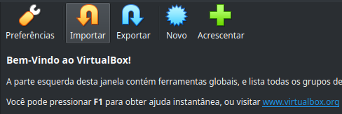

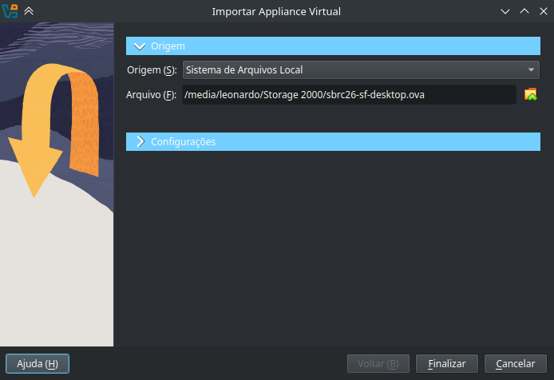

3. Clique em _Finalizar_ e aguarde o processo de importação.

4. Execute a VM recém importada.

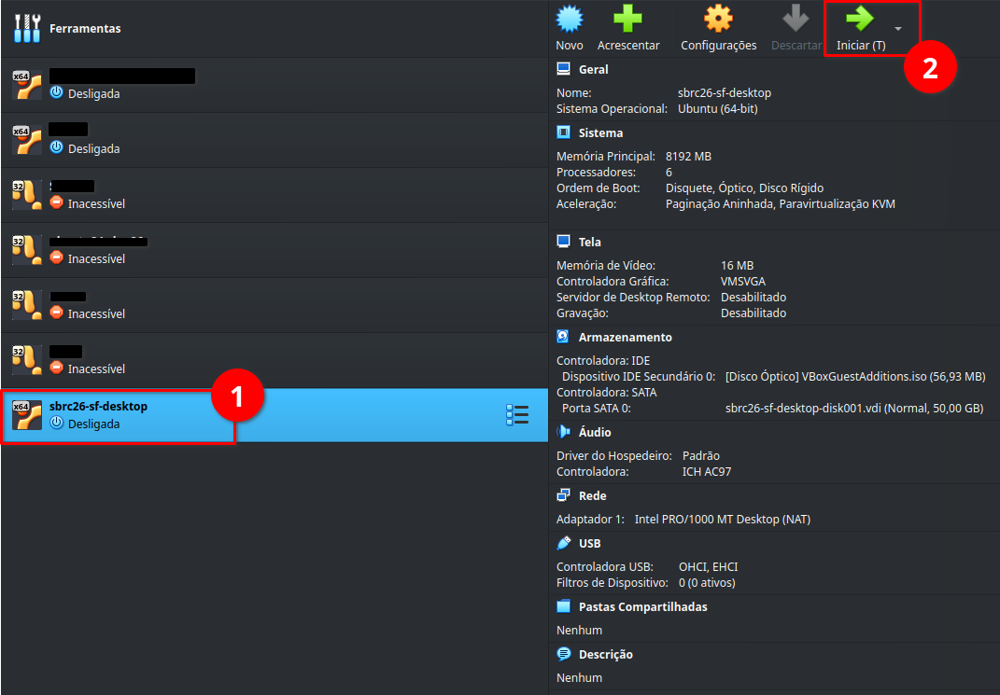

> [!IMPORTANT]  
> Caso seja exibida uma mensagem de erro do VirtualBox referente a interface de rede, isto é porque a nomenclatura do dispositivo de rede local é diferente daquela existente no computador onde a imagem foi gerada. Basta selecionar a opção "Alterar as opções de rede" e salvar sem nenhuma alteração.


5. Após a inicialização da VM e login (usuário **sbrc26** e senha **sbrc26**), abra o atalho do terminal no desktop, digite `experimento` e pressione Enter:

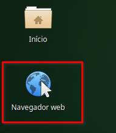

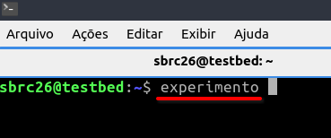

6. Quando o ambiente terminar de carregar, o navegador (Mozilla Firefox) abrirá automaticamente.
Caso isto não ocorra, há um atalho no desktop. O endereço de acesso à ferramenta estará indicado no terminal.

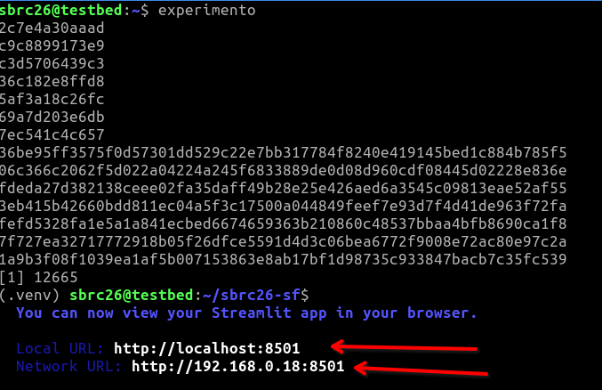

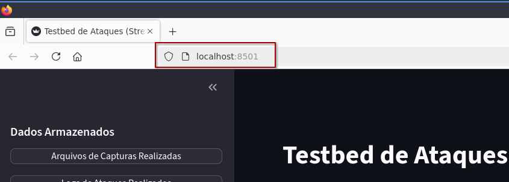

## **Opção 2: Execução manual dos procedimentos de instalação:**

1. Em um terminal do Linux local, executar:
```
sudo apt update && sudo apt install git -y
```

2. Aguarde o término da instalação do pacote `git`, clone o repositório e entre no diretório raiz do mesmo:

```
git clone https://github.com/ljbitzki/sbrc26-sf.git && cd sbrc26-sf/
```

### Instalação automatizada:

#### Estando no diretório raiz deste repositório, tornar executável o script `instalador1.sh` e executá-lo:

```
chmod +x instalador1.sh && ./instalador1.sh
```

Aguarde o término da instalação das dependências e da ferramenta ao término do `instalador1.sh` e execute os próximos comandos:

```
newgrp docker
```

Inicie o criador das imagens, executando o `instalador2.sh`:
```
./instalador2.sh
```

4. Aguarde o término do processo de construção das imagens e inicialização da ferramenta.
Ao concluir, serão exibidas informações em tela da URL em que a aplicação estará acessível.

**Nota:** _No ambiente de desenvolvimento, com recursos iguais aos da `Opção 2`, os procedimentos de instalação levaram em média `11 minutos e 30 segundos` para concluir na totalidade, baixando cerca de 3.3GB de dados pela internet e resultando no uso de 12GB de espaço adicional em disco. Este tempo deve variar conforme os recursos do ambiente de cada instalação._

#### Vídeo de demonstração da instalação do testbed em uma VM nova utilizando a `Opção 2`:

[](https://www.youtube.com/watch?v=qNCpw_xKxzU)

---

# Teste mínimo

#### O ambiente do testbed será considerado operacional se: (estando em um terminal no dispositivo onde a instalação foi executada)

1. A URL (resultante do comando seguinte) estiver acessível pelo navegador de internet:

```
echo "http://$( ip route get 9.9.9.9 | awk '{print $7; exit}' ):8501"
```

> [!TIP]
> Caso a URL não esteja acessível, reinicie o ambiente com o comando (estando na raiz do repositório):
```
./ambiente.sh reiniciar
```

2. O retorno de contagem mínima de conteineres esperada (resultante do comando seguinte) seja **`Containeres OK`**:
> [!TIP]
> Caso o retorno do comando seja **`Containeres NOT OK`**, execute novamente o builder das imagens (estando na raiz do repositório):
```
cd docker && ./build-images.sh
```

```
if [ $( docker images --format=table | grep -c 'sbrc26-' ) -gt 50 ]; then echo "Containeres OK"; else echo "Containeres NOT OK"; fi
```

---

# Experimentos

## Reivindicações: 

### Catálogo de ataques, servidores e cliente conteinerizados:

Para verificar a criação das 51 imagens de conteineres Docker componentes do **_testbed_**, execute em um terminal no dispositivo onde o ambiente foi instalado:
```
docker image ls -a --format table | grep 'sbrc26-'
```

### Informações sobre os servidores:

| **Servidor** | **Container (Nome)** | **Mapeamento de portas (host:container)** |
|-|-|-|
| `Web Server` | `sbrc26-servidor-http-server` | `TCP` **8080:80** |
| `SSH Server` | `sbrc26-servidor-ssh-server` | `TCP` **2222:22** |
| `SMB Server` | `sbrc26-servidor-smb-server` | `TCP`  **139:139**, **445:445** - `UDP` **137:137**, **138:138** |
| `MQTT Broker` | `sbrc26-servidor-mqtt-broker` | `TCP` **1883:1883**, **9001:9001** |
| `CoAP Server` | `sbrc26-servidor-coap-server` | `TCP` **5683:5683** - `UDP` **5683:5683** |
| `Telnet Server` | `sbrc26-servidor-telnet-server` | `TCP` **2323:23** |
| `SSL HeartBleed` | `sbrc26-servidor-ssl-heartbleed` | `TCP` **8443:443** |

### Operações do testbed:

#### Tela principal: Acessível em http://seu.endereço.ip:8501/

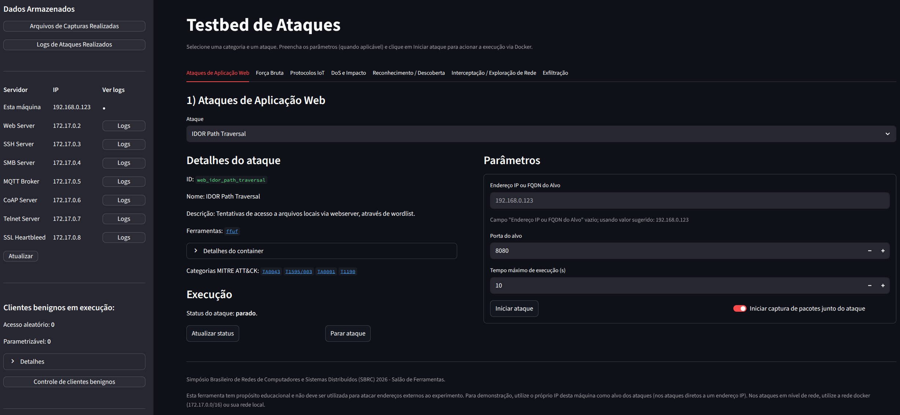

#### Funções da tela principal:

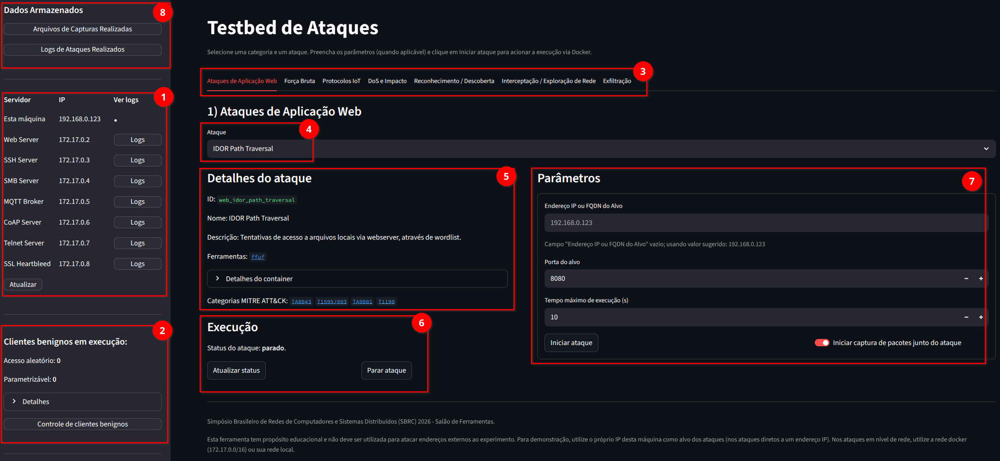

1. Status e visualização de logs dos servidores alvo
2. Status e controles sobre os clientes benignos
3. Menu de macro categorias dos ataques
4. Menu de seleção de um ataque específico
5. Detalhes do ataque selecionado (ID, Nome, Descrição, Imagem, Container e Categorização MITRE Att&ck)
6. Status e controles sobre a execução do ataque
7. Parâmetros de execução do ataque (Endereço IP, Porta do alvo e Tempo de execução, quando aplicável) e seletor de captura de pacotes simultânea
8. Menu de operações sobre capturas já realizadas e Logs dos ataques

#### Funções relativas aos logs dos servidores alvo:

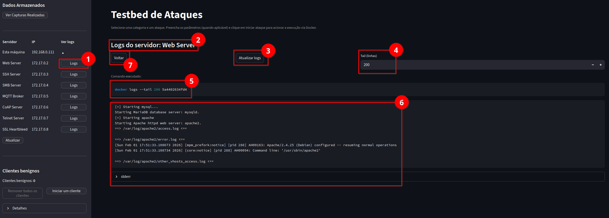

1. Abertura da tela de logs de um servidor alvo
2. Título da tela
3. Função para forçar a atualização dos logs exibidos
4. Seletor do número de linhas de logs para exibir (200 por padrão)
5. Comando executado para a obtenção dos logs
6. Exibição dos logs
7. Botão para voltar a tela anterior

#### Funções relativas aos clientes benignos:

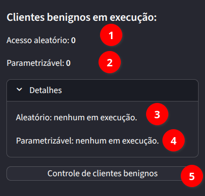

1. Informação do número de clientes de acessos aleatório atualmente em execução
2. Informação do número de clientes parametrizáveis atualmente em execução
3. Informação do nome dos clientes de acessos aleatório atualmente em execução
4. Informação do nome dos clientes parametrizáveis atualmente em execução
5. Menu de controle dos clientes benignos

#### Funções relativas ao controle dos clientes benignos (acessos aleatórios):

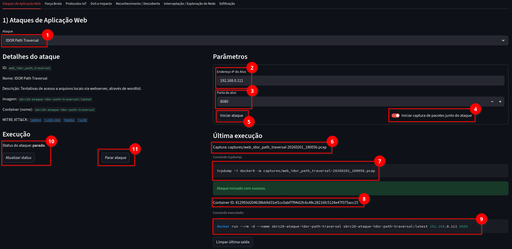

1. Menu seletor dos controles sobre os clientes de acessos aleatórios
2. Menu seletor dos controles sobre os clientes parametrizáveis
3. Iniciar mais um cliente de acessos aleatórios (cada clique inicia mais um cliente independente)
4. Remover todos os cliente de acessos aleatórios
5. Botão para forçar a atualização das visualizações
6. Informação adicional sobre a última ação
7. Informação sobre o comando executado na última ação
8. Controles sobre a exibição em tela dos logs consolidados sobre os clientes benignos
9. Botão para baixar o arquivo de log na íntegra

#### Funções relativas ao controle dos clientes benignos (parametrizável):

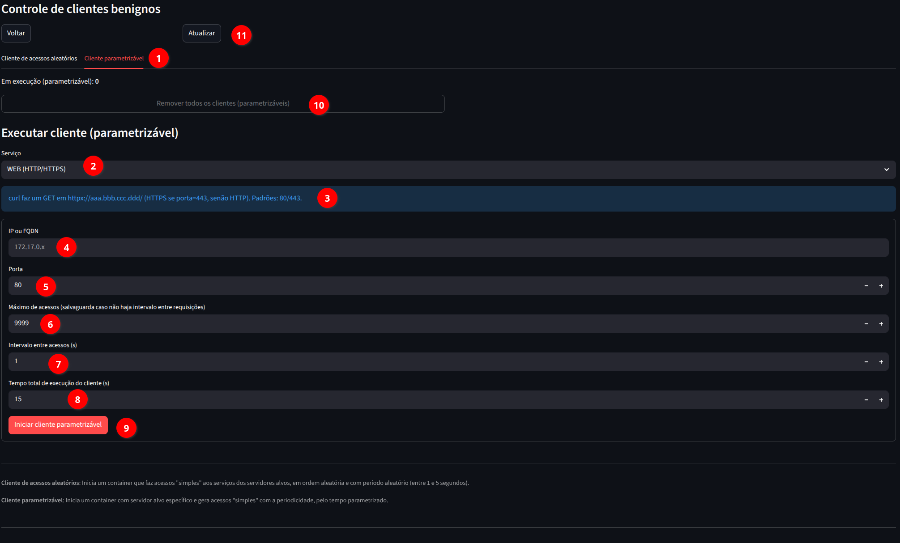

1. Menu de clientes benignos parametrizáveis
2. Menu seletor do serviço do cliente benigno parametrizável
3. Informações adicionais sobre o serviço do cliente benigno parametrizável
4. Endereço IP ou FQDN do Alvo
5. Porta do alvo
6. Número máximo de requisições
7. Intervalo entre requisições
8. Tempo máximo de execução
9. Controle para iniciar um cliente com os parâmetros especificados
10. Botão para remover todos os clientes em execução
11. Botão para forçar a atualização da visualização
12. Botão para baixar o arquivo de log na íntegra
13. Controles sobre a exibição em tela dos logs consolidados sobre os clientes benignos

#### Funções referentes a execução de um ataque:

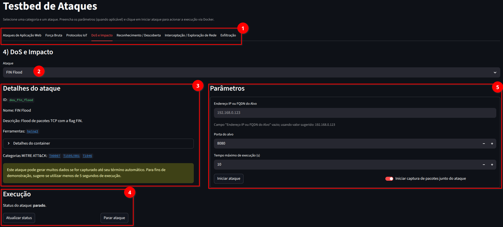
1. Menu de macro categorias dos ataques
2. Menu de seleção de um ataque específico
3. Detalhes do ataque selecionado (ID, Nome, Descrição, Imagem, Container e Categorização MITRE Att&ck)
4. Status e controles sobre a execução do ataque
5. Parametrização do ataque (IP ou FQDN, Porta e Duração)

#### Funções referentes à manipulação de arquivos de captura:


1. Botão de acesso ao módulo de visualização e processamento dos arquivos de captura
2. Nome do(s) arquivo(s) de captura armazenados no diretório `/captures`
3. Tamanho do arquivo de captura
4. Data de modificação do arquivo de captura
5. Botão para efetuar o download do arquivo de captura
6. Botão para acionar o módulo de extração de features

#### Funções referentes ao módulo de extração de features de um arquivo de captura:

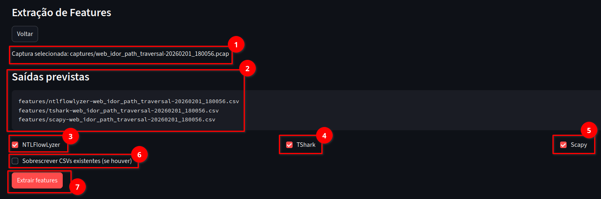

1. Nome do arquivo de captura selecionado
2. Nome dos arquivos `.csv` previstos pós extração `/features`
3. Seleção para extrair utilizando NTLFlowLyzer
4. Seleção para extrair utilizando Dumpcap TShark
5. Seleção para extrair utilizando Python Scapy
6. Seletor para forçar a reescrita dos arquivos `.csv` caso estes já existam de processamento anterior
7. Botão para a execução da extração das features conforme as opções selecionadas

#### Tela de resumo do processamento de features:

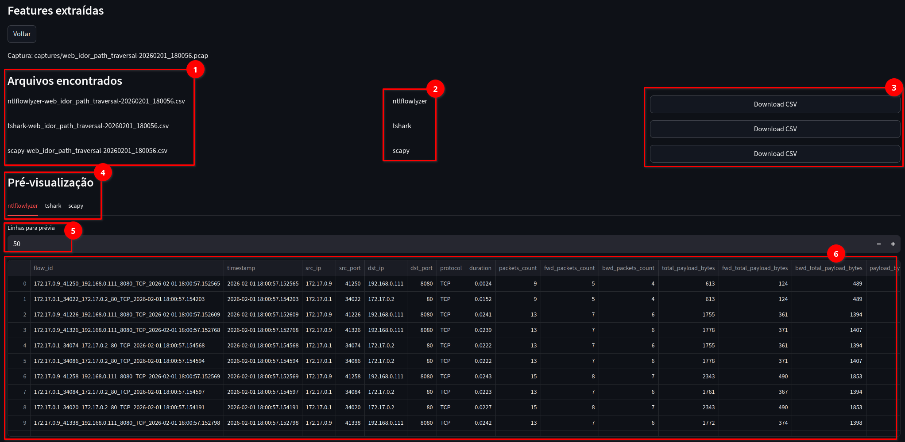

1. Status da execução da extração com NTLFlowLyzer (somente se selecionado na tela anterior) e arquivo resultante salvo em `/features`
2. Status da execução da extração com Dumpcap TShark (somente se selecionado na tela anterior) e arquivo resultante salvo em `/features`
3. Status da execução da extração com Python Scapy (somente se selecionado na tela anterior) e arquivo resultante salvo em `/features`

#### Funções referentes a pré-visualização das features extraídas e geração de dataset:

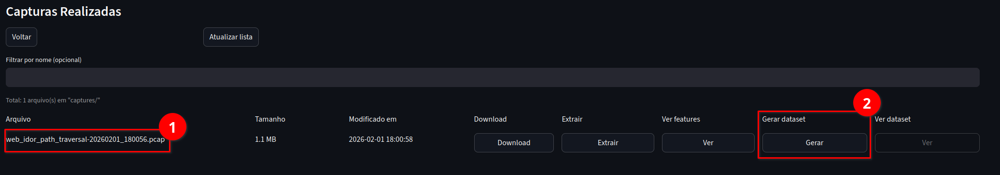

> Note que após um arquivo de captura ter features extraídas, são habilidados os botões adicionais
1. Nome do arquivo de captura
2. Botão para pré-visualização no navegador as features extraídas
3. Botão para gerar dataset de fluxos consolidados da extração de features já realizada

#### Tela de pré-visualização de features extraídas:


1. Arquivos referentes a extração e possíveis de serem visualizados
2. Informação da fonte de cada arquivo `.csv`
3. Botões para efetuar o download de cada arquivo `.csv` disponível
4. Seletor da fonte de dados para a visualização
5. Seletor do número de linhas para exibição (50 por padrão)
6. Tabela de visualização da fonte de dados selecionada

#### Geração de dataset de fluxos consolidados de extração de features já realizada:

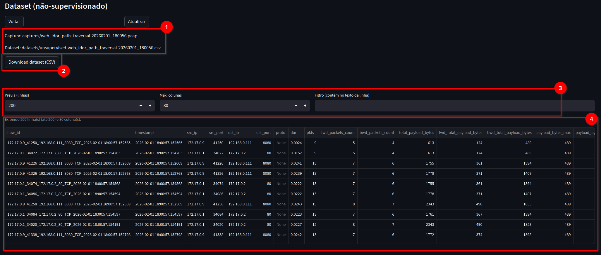

1. Nome do arquivo de captura
2. Botão para gerar o dataset em `datasets/`

#### Função para pré-visualização de dataset gerado:

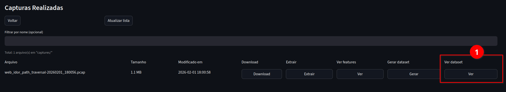

1. Seletor de pré-visualização de dataset

#### Tela de pré-visualização de dataset gerado:


1. Nome dos arquivos de captura e features extraídos relativos ao dataset
2. Botões para efetuar o download do arquivo `.csv` disponível
3. Seletor do número de linhas para exibição (200 por padrão), máximo de colunas (80 por padrão) e campo de busca/filtragem
4. Tabela de visualização do dataset

#### Tela de visualização dos logs consolidados dos ataques:

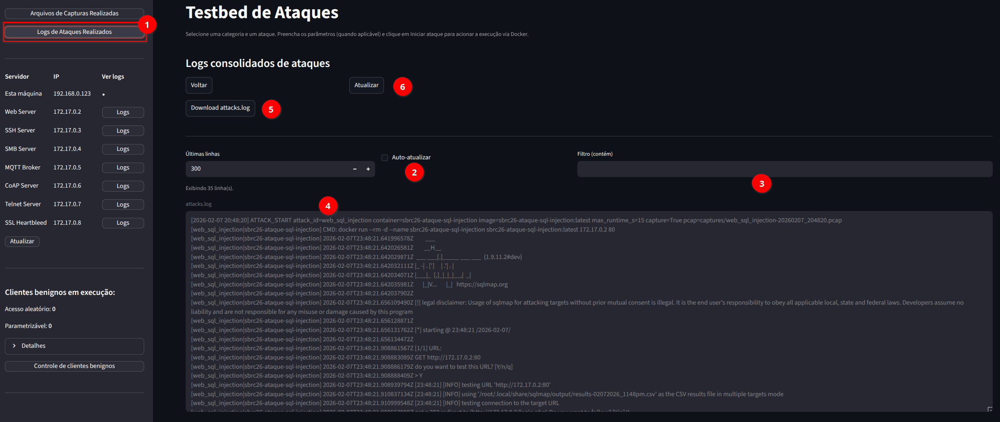

1. Botão para acesso ao visualizador de logs consolidados dos ataques
2. Opções sobre a visualização dos logs
3. Busca textual simples dentro dos logs
4. Exibição dos logs
5. Botão para efetuar download do arquivo consolidado dos logs de ataques
6. Botão para forçar a atualização da visualização

---

## Demonstração completa em vídeo do testbed e das reivindicações, utilizando o ambiente instalado manualmente (`Opção 2`)

[](https://www.youtube.com/watch?v=ZvMRpFVetvw)

---

# Documentação básica:

## Estrutura do projeto:
```
sbrc26-sf
|
├── assets/                   # Diretório auxiliar para documentação
├── captures/                 # Diretório de armazenamento das capturas .pcap
├── datasets/                 # Diretório de datasets gerados
├── docker/                   # Repositório de contêineres
│   ├── atacantes/            # Diretório dos contêineres atacantes
│   ├── build-images.sh       # Script de construção de todas as imagens
│   ├── clientes/             # Diretório dos contêineres clientes (benignos)
│   └── servidores/           # Diretório dos contêineres servidores alvo
├── features/                 # Diretório dos CSV de extração de features
├── modules/                  # Diretório dos módulos da ferramenta
│   ├── datasets.py           # Módulo de geração de datasets
│   ├── features.py           # Módulo de extração de features
│   ├── registry.py           # Módulo de declaração das especificações dos contêineres
│   └── runners.py            # Módulo de ações práticas da ferramenta
├── ambiente.sh               # Script para reiniciar o ambiente como um todo
├── clientes.sh               # Script para controlar manualmente os contêineres de clientes
├── ferramenta.py             # Arquivo principal da ferramenta
├── ferramenta-cli.py         # Arquivo da ferramenta em versão CLI
├── instalador1.sh            # Script automatizado para instalação das dependências
├── instalador2.sh            # Script para geração das imagens e artefatos Docker
├── LICENSE                   # Arquivo de licença da ferramenta (GNU GENERAL PUBLIC LICENSE)
├── README.md                 # Este arquivo README.md
├── requirements.txt          # Arquivo com requisitos de pacotes Python do instalador PIP
└── servidores.sh             # Script para controlar manualmente os servidores alvo
```

## Documentação das funções (gerado por documentação inline do tipo Docstrings junto ao código) via Sphinx:

Documentação dos módulos e funções: [CLIQUE AQUI](https://leftredshift.github.io/api/index.html)

# Ambiente de testes:
***Hardware:*** Processador: AMD Ryzen 5 5500X, Memória RAM: 8GB DDR4, Armazenamento SSD.
***Software (Pincipal):*** Sistema Operacional: Kubuntu 24.04 LTS, Python 3.12 e módulo VENV, Docker Engine 29.2.1 e VirtualBox 7.1

<details><summary>

# Troubleshoot:
</summary>

### Portas já em uso no computador local:

#### Problema 1: Já há um serviço utilizando uma porta que é necessária para um dos servidores: [Ver relação de portas, sessão "Experimentos"](https://github.com/GT-IoTEdu/sbrc2026-ataques?tab=readme-ov-file#experimentos):
#### Exemplo 1: A porta 8080, utilizada pelo mapeamento do servidor `sbrc26-servidor-http-server` já está em uso por algum outro serviço local:
```
docker: Error response from daemon: failed to set up container networking: driver failed programming external connectivity on endpoint sbrc26-servidor-http-server (container-id): failed to bind host port 0.0.0.0:8080/tcp: address already in use
```
#### Solução 1: 
1. Parar o serviço local que já está em uso; ou
2. Trocar a porta de mapeamento que está causando o conflito e subir o servidor novamente (modificar e utilizar o script `servidores.sh`)

</details>

# LICENSE

Este projeto está licenciado sob a Licença GNU General Public License v3.0 - veja o arquivo [LICENSE](LICENSE) para mais detalhes.